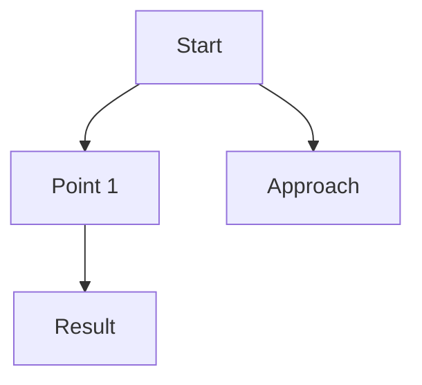

# ob - Obsidian Vault CLI

Interact with an Obsidian-compatible vault from the command line.
JSON output by default (for AI Agent integration). Works without the desktop app.

## Prerequisites

Requires Go 1.21+ installed. On first use, build the binary:

```bash
wails3 task cli:build    # builds bin/ob
wails3 task cli:install  # installs to /usr/local/bin
```

## Vault Configuration (IMPORTANT)

The vault path is configured once in `~/.config/obails/config.toml` and should ONLY be changed by the user manually.

> **CRITICAL**: The `--vault` flag exists for manual debugging by humans only.
> - AI agents (including Claude Code) MUST NEVER use `--vault` flag
> - AI agents MUST NEVER modify config.toml
> - If vault path is not set, instruct the user to configure it manually in config.toml
> - Do NOT attempt to "fix" vault configuration programmatically

Example config (`~/.config/obails/config.toml`):

```toml
[vault]
  path = "/path/to/your/vault"

[daily_notes]
  folder = "02_dailynotes"
  format = "2006-01-02"
  template = "daily_note"

[timeline]
  section = "## Memos"
  time_format = "15:04"

[templates]
  folder = "99_template"
```

### Vault Folder Structure

| Folder | Purpose |
|--------|---------|
| `02_dailynotes` | Daily notes |
| `03_文献ノート` | Literature notes (default for research output) |
| `99_template` | Note templates |
| `attachment/` | Attached images, diagrams, files |

## Syntax

```bash
ob <command> [key=value...] [--flags...]
```

Both standard flags (`--file MyNote`) and Obsidian-compatible `key=value` syntax (`file=MyNote`) are supported.

Examples:
```bash
ob read file="MyNote"
ob read --file MyNote
ob append file="MyNote" content="Hello" section="## Notes"
```

## Global Flags

| Flag | Default | Description |
|------|---------|-------------|
| `--format` | `json` | Output format: `json` or `text` |

## Commands

### App Control

#### `open` - Open a note in the Obails app
```bash
ob open file=<name>              # Open app with specific note
ob open path=<relative_path>     # Open app with specific path
ob open                          # Just launch the app
```

### Read Operations

#### `read` - Read a note
```bash
ob read file=<name>                            # Wiki-link resolution
ob read path=<relative_path>                   # Direct path
ob read file=<name> --section "## Heading"     # Extract section only
```

#### `outline` - Extract headings
```bash
ob outline file=<name>
ob outline file=<name> style=md    # Markdown list
ob outline file=<name> --total     # Count only
```

#### `properties` - Read frontmatter
```bash
ob properties file=<name>
ob properties file=<name> name=title  # Single property
```

#### `search` - Search vault
```bash
ob search query=<text>                # File name search
ob search query=<text> --matches      # Content search
ob search query=<text> limit=10 --case  # Case-sensitive, limit results
```

### Write Operations

#### `create` - Create a new note
```bash
ob create name=<name>
ob create name=<name> content="Initial content"
ob create name=<name> template=<template_name>
ob create name=<name> folder=subfolder --overwrite --silent
```

#### `append` - Append to a note
```bash
ob append file=<name> content="New line"
ob append file=<name> content="In section" section="## Notes"
ob append file=<name> content=" inline text" --inline  # No newline prefix
ob append file=<name> content="Line 1\nLine 2"         # \n = newline
```

#### `prepend` - Prepend to a note (after frontmatter)
```bash
ob prepend file=<name> content="At the top"
ob prepend file=<name> content=" inline" --inline
```
Inserts after frontmatter if present.

#### `upsert` - Create or append
```bash
ob upsert file=<name> content="Text"
ob upsert file=<name> content="Text" section="## Log"
ob upsert file=<name> content="Text" template=<tmpl>
```
If note exists: appends. If not: creates (optionally from template), then appends.

### Daily Notes

#### `daily read` - Read today's daily note
```bash
ob daily read
ob daily read --date 2025-01-15
```
Creates the note if it doesn't exist.

#### `daily append` / `daily prepend`
```bash
ob daily append content="Meeting notes"
ob daily append content="Notes item" section="## Notes"
ob daily prepend content="Priority item"
```

#### `daily timeline` - Add timestamped entry
```bash
ob daily timeline content="Started working on feature X"
ob daily timeline content="Review PR" --todo  # Creates checkbox: - [ ] HH:MM text
```
Adds entry to the configured Memos section with auto-timestamp.

### Tasks

#### `tasks` - List tasks
```bash
ob tasks                        # All tasks in vault
ob tasks file=<name>            # Tasks in specific file
ob tasks --daily                # Today's daily note only
ob tasks --todo                 # Uncompleted only
ob tasks --done                 # Completed only
ob tasks --total                # Count only
```

#### `task` - Modify a task
```bash
ob task file=<name> line=18 --toggle    # Toggle done/undone
ob task file=<name> line=18 --done      # Mark done
ob task file=<name> line=18 --todo      # Mark undone
ob task file=<name> line=18 status=/    # Custom status (e.g., in-progress)
```

### Link Analysis

#### `links` - Outgoing links from a file
```bash
ob links file=<name>
ob links file=<name> --total
```

#### `backlinks` - Files linking to a file
```bash
ob backlinks file=<name>
ob backlinks file=<name> --total
```

#### `orphans` - Files with no incoming links
```bash
ob orphans
ob orphans --total
```

#### `deadends` - Files with no outgoing links
```bash
ob deadends
ob deadends --total
```

#### `unresolved` - Broken wiki-links
```bash
ob unresolved
ob unresolved --total
```

## Literature Note Creation

When saving research findings, survey results, or article summaries to the vault, use the following workflow. The default output folder is `03_文献ノート`.

### Naming Convention

```
YYYY-MM-DD-HHmm-<slug>.md
```

Get the timestamp with `date "+%Y-%m-%d-%H%M"`. Never fabricate dates.

### Note Template

```markdown
---
title: <Japanese title>
created: "<run: date '+%Y-%m-%d %H:%M:%S %z'>"
tags:
  - obsidian
  - literature-note
read: false
important: false
source: "<URL>"
---

## Overview
- 2-3 sentence summary of the topic.

## Details
1. Key points organized as bullet list.
2. Cite data concisely.

## Key Takeaways
- Specific insight 1
- Specific insight 2

## Practical Applications
- How to apply in practice
- Risks and caveats

## Mermaid

(Validated with Mermaid CLI)

## References
- [Source Title](<URL>)
```

### Creation via ob CLI

```bash
# Create a literature note in 03_文献ノート
ob create name="2025-06-15-1430-react-server-components" \
  folder="03_文献ノート" \
  content="---
title: React Server Componentsの設計原則
created: \"$(date '+%Y-%m-%d %H:%M:%S %z')\"
tags:
  - obsidian
  - literature-note
read: false
important: false
source: \"https://example.com/article\"
---

## Overview
..."
```

### Mermaid Diagram Rules

- Every literature note SHOULD include at least one Mermaid diagram.
- Validate diagrams before saving:
  ```bash
  echo 'graph TD; A-->B' > /tmp/check.mmd
  npx -y @mermaid-js/mermaid-cli --check /tmp/check.mmd
  ```
- If validation fails, fix the syntax and retry. Do not save broken diagrams.
- Clean up temp files (`/tmp/*.mmd`, `/tmp/*.svg`) after validation.

### Attachments

Store images and generated diagrams under `attachment/<topic>/` in the vault.

### Rules for Literature Notes

- Write all note content in Japanese.
- Always get timestamps via `date` command. Never hardcode or guess dates.
- Process articles independently — if one fails, continue with the rest.
- For TikZ diagrams: compile with `pdflatex`, convert to PNG/SVG via `magick`, store in `attachment/<topic>/`, and include the TikZ source as a code block (Obsidian cannot render raw TikZ).

## Error Handling

If you encounter a "vault path not configured" error:
- Do NOT try to fix it programmatically
- Instruct the user to set the vault path manually in `~/.config/obails/config.toml`

If iCloud vault path is not accessible:
- Verify with `ls` that the path is mounted
- If not synced, ask the user to check iCloud sync status

## Common AI Agent Patterns

```bash
# Log work progress
ob daily timeline content="Implemented auth module"

# Append learnings to a knowledge note
ob upsert file="Go Best Practices" content="Always wrap errors" section="## Tips"

# Find related notes
ob backlinks file="Architecture"

# Read a specific section
ob read file="ProjectPlan" --section "## Phase 2"

# Create a new note from template
ob create name="Meeting 2025-01-15" template="meeting"

# Open note in the app after writing
ob daily timeline content="Done for today" && ob open

# Save research as a literature note
ob create name="$(date +%Y-%m-%d-%H%M)-topic-slug" \
  folder="03_文献ノート" \
  content="$(cat /tmp/literature-note.md)"

# Search for existing literature notes
ob search query="React" --matches
```
