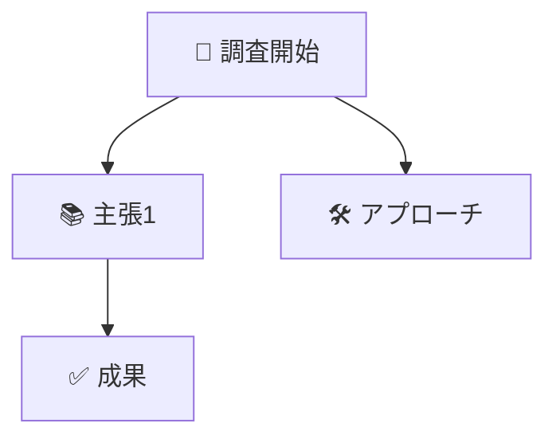

```markdown
---
title: <日本語タイトル>
created: "<date '+%Y-%m-%d %H:%M:%S %z'>"
tags:
  - obsidian
  - literature-note
read: false
important: false
source: "<URL>"
---

## 概要
- 主題の要約を2〜3文で記述。

## 詳細内容
1. 箇条書きで論点を整理。
2. 引用やデータは簡潔に。

## 重要なポイント
- ✅ 具体的な気付き1
- ✅ 具体的な気付き2

## 実践的な活用方法
- 現場適用アイデア
- リスクや注意点

## Mermaid

(Mermaid CLIで`--check`済み)

## 参考
- [出典タイトル](<URL>)
```
